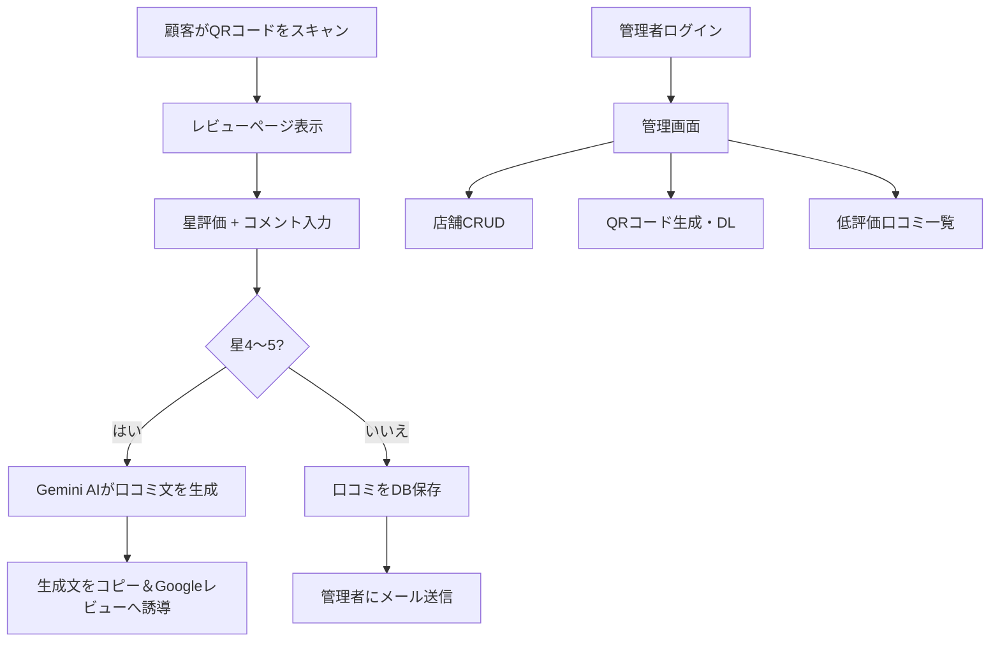

# QRコード口コミ支援システム（レビューナビ風）

店頭に設置したQRコードからスマホで口コミを投稿できるシステム。Gemini AIで自然な口コミ文を生成し、高評価（4〜5星）はGoogleマップへ誘導、低評価（1〜3星）は管理者にメール通知する。

## User Review Required

> [!IMPORTANT]
> **ロリポップサーバーの制約**：ロリポップのスタンダードプラン以上でLaravelが動作します。PHP 8.1以上・MySQL/MariaDB・SSH接続が必要です。プランの確認をお願いします。

> [!IMPORTANT]
> **Pure PHP vs Laravel**：ロリポップの環境次第ではLaravelのセットアップが複雑になる場合があります。シンプルなPHP＋素のMySQLでも構築可能です。どちらを希望しますか？

## システム構成図



## データベース設計

### テーブル構成

| テーブル | 用途 |
|---------|------|
| `admins` | 管理者ユーザー |
| `stores` | 店舗情報（名前、Google口コミURL、メール通知先等） |
| `reviews` | 全口コミ記録（星評価、コメント、AI生成文、ステータス） |

```sql
-- stores テーブル
CREATE TABLE stores (
    id BIGINT UNSIGNED AUTO_INCREMENT PRIMARY KEY,
    name VARCHAR(255) NOT NULL,
    google_review_url VARCHAR(500) NOT NULL,
    notify_email VARCHAR(255) DEFAULT 'shichi@assist-grp.jp',
    slug VARCHAR(100) UNIQUE NOT NULL,  -- QRコードURL用のスラッグ
    is_active TINYINT(1) DEFAULT 1,
    created_at TIMESTAMP NULL,
    updated_at TIMESTAMP NULL
);

-- reviews テーブル
CREATE TABLE reviews (
    id BIGINT UNSIGNED AUTO_INCREMENT PRIMARY KEY,
    store_id BIGINT UNSIGNED NOT NULL,
    rating TINYINT NOT NULL,          -- 1〜5
    comment TEXT,                      -- 顧客の自由記入
    ai_generated_text TEXT,            -- Gemini AIが生成した口コミ文
    status ENUM('redirected_to_google', 'email_sent') NOT NULL,
    created_at TIMESTAMP NULL,
    updated_at TIMESTAMP NULL,
    FOREIGN KEY (store_id) REFERENCES stores(id)
);

-- admins テーブル
CREATE TABLE admins (
    id BIGINT UNSIGNED AUTO_INCREMENT PRIMARY KEY,
    name VARCHAR(255) NOT NULL,
    email VARCHAR(255) UNIQUE NOT NULL,
    password VARCHAR(255) NOT NULL,
    created_at TIMESTAMP NULL,
    updated_at TIMESTAMP NULL
);
```

## Proposed Changes

### 顧客向けレビューページ（フロントエンド）

#### [NEW] `public/review/{store_slug}` — レビューページ

- **スマホ最適化**のレスポンシブデザイン（モバイルファースト）
- 店舗名を動的に表示
- **星評価UI**：タップで1〜5星を選択（アニメーション付き）
- **自由テキスト入力欄**：来店の感想やサービスの感想を自由記入
- **送信ボタン**：評価を送信

---

### レビュー処理（バックエンド）

#### [NEW] `ReviewController.php`

1. **レビュー受信** (`POST /review/{store_slug}`)
   - バリデーション（星1〜5、コメント必須）
   - DBに口コミ記録を保存

2. **星4〜5の場合**
   - Gemini API呼び出し → 口コミ文を自動生成
   - プロンプト例：「以下の評価とコメントを元に、Googleマップに投稿する自然な口コミ文を日本語で生成してください。評価：5星、コメント：接客が丁寧で良かった」
   - 生成文を画面に表示 → 顧客がコピーしてGoogleレビューページへ移動
   - ステータス：`redirected_to_google`

3. **星1〜3の場合**
   - お礼メッセージを顧客に表示（「ご意見ありがとうございます。サービス改善に活用させていただきます」）
   - メール送信（さくらSMTP経由 → `shichi@assist-grp.jp`）
   - メール内容：店舗名、星評価、コメント全文、投稿日時
   - ステータス：`email_sent`

---

### Gemini AI連携

#### [NEW] `GeminiService.php`

- Google Gemini API（`gemini-2.0-flash`）で口コミ文を生成
- 入力：星評価 + 顧客コメント + 店舗名
- 出力：自然な日本語の口コミ文（100〜200文字程度）
- APIキーは `.env` で管理

---

### 管理画面

#### [NEW] 認証機能
- ログイン/ログアウト（Laravel Breeze or シンプルなセッション認証）
- 初期管理者はシーダーで作成

#### [NEW] 店舗管理（CRUD）
- 店舗一覧テーブル表示
- 新規追加フォーム（店舗名、Google口コミURL、通知先メール）
- 編集・削除

#### [NEW] QRコード生成
- 各店舗の `https://{domain}/review/{store_slug}` をQRコード画像として生成
- ダウンロードボタン（PNG形式）
- テーブル設置用の印刷に適したサイズ

#### [NEW] 低評価口コミ一覧
- 星1〜3の口コミをフィルター表示
- 店舗名、日時、星評価、コメント内容を一覧表示
- CSVエクスポート機能（任意）

---

### メール送信設定

#### [MODIFY] `.env`

```
MAIL_MAILER=smtp
MAIL_HOST=<さくらレンタルサーバーのSMTPホスト>
MAIL_PORT=587
MAIL_USERNAME=shichi@assist-grp.jp
MAIL_PASSWORD=<パスワード>
MAIL_ENCRYPTION=tls
MAIL_FROM_ADDRESS=shichi@assist-grp.jp
MAIL_FROM_NAME="口コミ通知"

GEMINI_API_KEY=<Gemini APIキー>
```

## ディレクトリ構成（Laravel）

```
qr-review/
├── app/
│   ├── Http/Controllers/
│   │   ├── ReviewController.php      # 顧客向けレビュー処理
│   │   ├── Admin/
│   │   │   ├── StoreController.php   # 店舗CRUD
│   │   │   ├── ReviewController.php  # 低評価口コミ一覧
│   │   │   └── QrCodeController.php  # QRコード生成
│   │   └── Auth/LoginController.php  # 管理者ログイン
│   ├── Models/
│   │   ├── Admin.php
│   │   ├── Store.php
│   │   └── Review.php
│   ├── Services/
│   │   └── GeminiService.php         # Gemini AI連携
│   └── Mail/
│       └── LowRatingNotification.php # 低評価通知メール
├── resources/views/
│   ├── review/
│   │   ├── form.blade.php            # レビュー入力フォーム
│   │   ├── google-redirect.blade.php # AI生成文表示&Google誘導
│   │   └── thankyou.blade.php        # 低評価時のお礼画面
│   └── admin/
│       ├── login.blade.php
│       ├── stores/
│       │   ├── index.blade.php
│       │   ├── create.blade.php
│       │   └── edit.blade.php
│       ├── reviews/index.blade.php
│       └── qrcode/show.blade.php
├── database/migrations/
│   ├── create_admins_table.php
│   ├── create_stores_table.php
│   └── create_reviews_table.php
├── routes/web.php
└── .env
```

## 主要ライブラリ

| パッケージ | 用途 |
|-----------|------|
| `simplesoftwareio/simple-qrcode` | QRコード生成 |
| `guzzlehttp/guzzle` | Gemini API通信 |
| Laravel標準 Mail | メール送信 |

## Verification Plan

### ローカルでの動作テスト

1. **Laravelプロジェクト起動**
   ```bash
   php artisan serve
   ```

2. **レビューフォームの表示確認**
   - ブラウザで `http://localhost:8000/review/test-store` にアクセス
   - 星評価UIとコメント入力欄が表示されることを確認

3. **高評価フロー（星4〜5）テスト**
   - 星5 + コメントを入力して送信
   - Gemini AIが口コミ文を生成し表示されることを確認
   - 「Googleレビューに投稿」ボタンが表示されることを確認

4. **低評価フロー（星1〜3）テスト**
   - 星2 + コメントを入力して送信
   - お礼画面が表示されることを確認
   - `shichi@assist-grp.jp` にメールが届くことを確認

5. **管理画面テスト**
   - ログイン → 店舗追加 → QRコード生成 → ダウンロード
   - 低評価口コミ一覧に投稿が表示されることを確認

### 手動テスト（ユーザー確認）
- スマホでQRコードを読み取り、レビューフローを最初から最後まで確認していただく
- ロリポップサーバーへデプロイ後の動作確認
